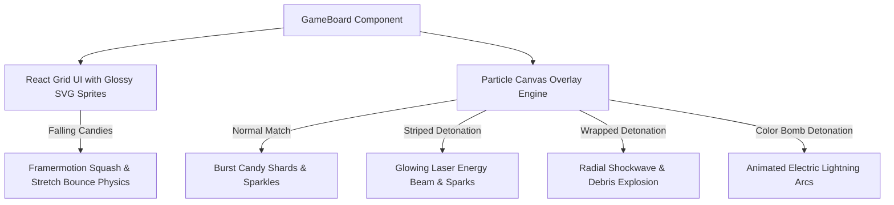

# Implementation Plan - Visual & Animation Enhancements 🎨✨

Elevate the Candy Crush game experience with high-end visual FX, explosive HTML5 Canvas particle bursts, laser beams, lightning arcs, glossy Sri Lankan candy graphics, and fluid tile drop physics.

---

## Proposed Architecture & Features

---

## 🎨 Key Features & Components

### 1. Particle Overlay Canvas Engine (`src/utils/particles.js`, `src/components/ParticleCanvas.jsx`)
- **Particle Overlay Layer**: Transparent `<canvas>` overlaid on top of the game board with `pointer-events: none` running a 60 FPS requestAnimationFrame render loop.
- **Match Particles**: Spawns 15–20 glowing color-matched shard particles that explode outward with randomized velocity, gravity deceleration, and smooth fade-out.
- **Striped Laser Energy Beams**: Renders expanding laser beams with core white-hot energy lines, glowing outer halos, and drifting trailing sparks.
- **Color Bomb Lightning Arcs**: Draws animated electrical lightning bolts (`ctx.beginPath()` with procedural zig-zag jitter) connecting the Color Bomb to every target candy on the board.
- **Wrapped Shockwaves**: Renders expanding double radial shockwave rings with smoke rings and debris.

### 2. Glossy Sri Lankan SVG Candy Art (`src/components/CandySprite.jsx`)
- Glossy, vibrant 2D SVG candy designs with Sri Lankan artistic touches:
  - 🔴 **Red (Kavum Dome)**: Rich ruby dome with glossy reflection highlights.
  - 🟡 **Yellow (Kokis Star)**: Golden Sri Lankan Kokis star pattern with radial shimmer.
  - 🟢 **Green (Dodol Diamond)**: Crystalline emerald diamond with bevel highlights.
  - 🟣 **Purple (Royal Star)**: Deep violet star with inner sparkle glow.
  - 🔵 **Blue (Ocean Hexagon)**: Deep blue hexagon with glassmorphic gradients.
  - 🟠 **Orange (Mango Square)**: Vibrant orange rounded tile with 3D gradient depth.

### 3. Squash-and-Stretch Drop Physics (`src/components/GameBoard.jsx`)
- **Landing Bounce**: When candies drop from above, apply a subtle squash-and-stretch elasticity animation (`scaleY: 1.15` $\rightarrow$ `scaleY: 0.9` $\rightarrow$ `scaleY: 1.0`) for organic, satisfying motion.
- **Tile Swap Pathing**: Smooth spring-physics transition when tiles swap positions.

---

## Proposed File Changes

### [NEW] [src/utils/particles.js](file:///c:/Users/asus/Documents/apps/candy_crush_saga/src/utils/particles.js)
- Core particle physics engine: particle creation, velocity updating, canvas rendering routines for shards, lasers, shockwaves, and lightning arcs.

### [NEW] [src/components/ParticleCanvas.jsx](file:///c:/Users/asus/Documents/apps/candy_crush_saga/src/components/ParticleCanvas.jsx)
- HTML5 Canvas React wrapper component listening to match/explosion events and animating FX overlay.

### [NEW] [src/components/CandySprite.jsx](file:///c:/Users/asus/Documents/apps/candy_crush_saga/src/components/CandySprite.jsx)
- Glossy SVG candy sprite renderer supporting normal candies, striped overlay lines, wrapped candy glow wrappers, and Color Bomb sprinkle donuts.

### [MODIFY] [src/components/GameBoard.jsx](file:///c:/Users/asus/Documents/apps/candy_crush_saga/src/components/GameBoard.jsx)
- Connect Particle Canvas overlay to board matches and special detonations.
- Apply `CandySprite` and squash-and-stretch Framer Motion animation properties to grid tiles.

---

## Verification Plan

### Automated Tests & Build Verification
- Execute `cmd /c "npm run build"` to verify all canvas animation code compiles without syntax or bundle errors.

### Manual Verification
1. **Match Particles**: Make 3-candy matches and verify color-matched particle bursts explode and fade smoothly.
2. **Striped Lasers**: Detonate a Striped Candy and verify glowing row/column laser beam sweeps across the grid.
3. **Color Bomb Lightning**: Swap a Color Bomb and verify electric lightning bolts arc to all matching candies.
4. **Candy Graphics**: Verify glossy SVG candies render clearly on mobile viewports.
